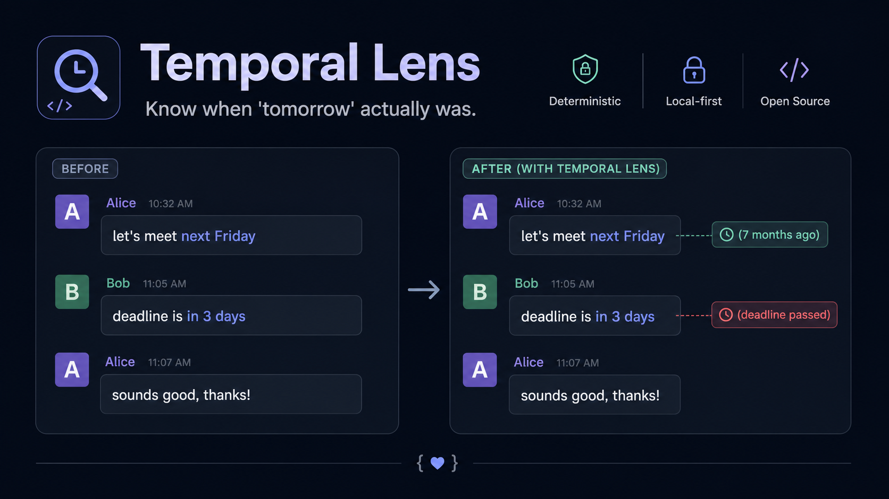

# Temporal Lens

Ever almost replied to a "see you tomorrow!" message that was actually posted 8 months ago? Temporal Lens fixes that.

## The Problem

Relative time references like "tomorrow," "next Friday," "in 3 days," and "this weekend" become meaningless when you read them later. Scrolling an old Discord thread, Reddit post, Slack archive, or forum, you cannot tell if "the deadline is in 3 days" already passed or is still coming. People reply to dead threads or miss live ones because they did the date math wrong in their head.

## The Solution

Temporal Lens annotates those phrases inline with what they actually resolve to, anchored to when the message was originally posted. "next Friday" shows "(in 4 days)" the day it was posted and "(7 months ago)" when you read it later. Labels live-refresh so they stay accurate relative to now.

## What Makes It Different

- Fully local and deterministic.
- No AI, no API keys, no accounts, no cost, and no rate limits.
- Message text never leaves the browser.
- Zero telemetry and zero network calls.
- Anchors to each message's original post time so resolution is always correct.
- Works on Discord, Slack, and general websites.
- Preserves original text. It annotates, never rewrites.
- Live-refreshing labels.
- Configurable confidence threshold and per-platform toggles.

## Install

Download or clone this repository:

```bash
git clone https://github.com/tweakyourpc/temporal-lens.git
cd temporal-lens
```

Load the extension in Chrome:

```text
1. Open chrome://extensions
2. Enable Developer Mode
3. Click Load unpacked
4. Select the Temporal Lens extension folder
5. Open the popup to configure confidence and platform settings
```

Load the extension in Microsoft Edge:

```text
1. Open edge://extensions
2. Enable Developer Mode
3. Click Load unpacked
4. Select the Temporal Lens extension folder
5. Open the popup to configure confidence and platform settings
```

## How It Works

Temporal Lens is a Manifest V3 extension with no build step required. The shipped extension is:

```text
temporal-lens/
|-- manifest.json
|-- background/
|-- content/
|-- components/
|-- popup/
|-- styles/
`-- utils/
```

A `MutationObserver` watches for new messages. A local regex-based extractor identifies temporal expressions and classifies them into normalized anchors. Anchors resolve against each message's posted timestamp. A `TreeWalker` wraps the matched phrase in an annotation element without breaking page structure. IndexedDB caches results with a 7-day TTL.

Local preview assets live under `preview/` and are not part of the shipped extension.

Run the preview over LAN with Port Broker:

```bash
portbroker alloc --name temporal-lens-preview
PORT=$(portbroker get --name temporal-lens-preview) HOST=0.0.0.0 npm run preview
```

The preview server includes:

```text
GET /whoami
GET /
GET /manifest.json
```

## Package A Release Zip

```bash
scripts/package.sh
```

The script creates `temporal-lens-<version>.zip` containing only the shipped extension files:

```text
manifest.json
background/
content/
components/
popup/
styles/
utils/
```

## Privacy

Temporal Lens collects nothing, sends nothing, and has no servers, analytics, or API calls. Message text never leaves your browser.

Read the full privacy statement in [PRIVACY.md](PRIVACY.md).

## Roadmap And Contributing

Community help is welcome, especially for expanding the pattern library, improving date parsing coverage, and adding platform-specific selectors for more sites.

Useful contribution areas:

- More English temporal expressions.
- Better selectors for Discord, Slack, forums, and archive-heavy sites.
- Additional tests for edge cases around weekdays, months, and ambiguous phrases.
- Accessibility review for annotation chips.

## License

MIT. See [LICENSE](LICENSE).
